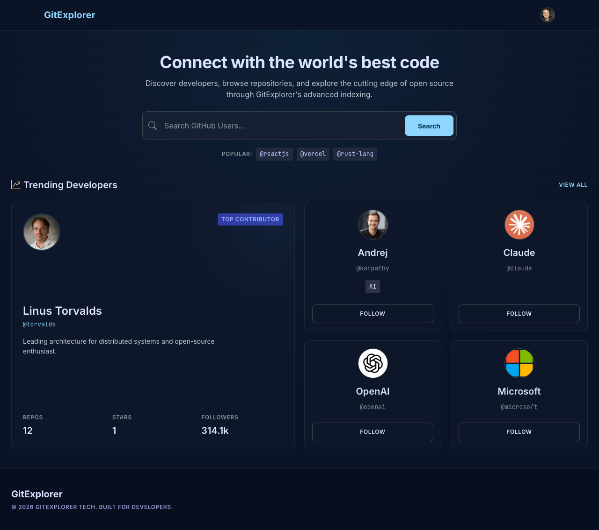
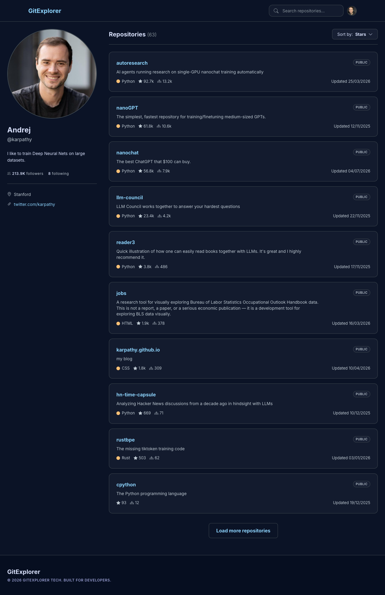
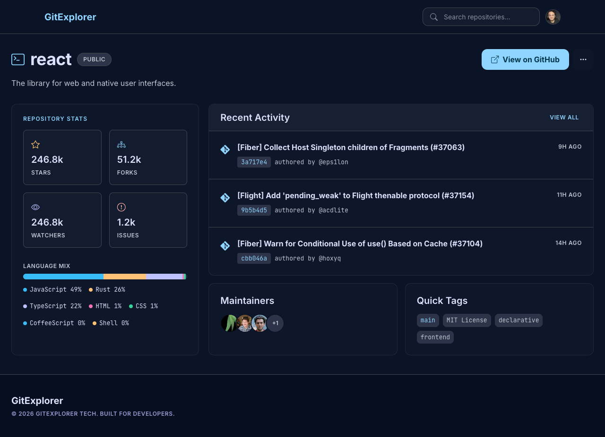

# GitExplorer

Interface web para explorar desenvolvedores e repositórios do GitHub. Busque perfis, navegue por trending developers, visualize repositórios e acesse detalhes com uma experiência responsiva para mobile e desktop.

## Screenshots

### Home

<p align="center">
  
</p>

### Perfil

<p align="center">
  
</p>

### Detalhes do repositório

<p align="center">
  
</p>

## Funcionalidades

- **Home** — busca de desenvolvedores e repositórios, com resultados em tempo real
- **Trending Developers** — lista paginada de desenvolvedores em alta (`/developers/trending`)
- **Perfil** — página de usuário com bio, estatísticas, filtros e repositórios (`/users/:login`)
- **Repositório** — detalhes do repo com stats, linguagens, atividade e maintainers (`/repos/:owner/:repo`)
- **Integração GitHub** — botão na navbar que abre o GitHub; com token configurado, exibe o avatar do usuário autenticado
- **Skeletons de carregamento** — estados de loading específicos por tela

## Stack

| Camada | Tecnologia |
|--------|------------|
| Runtime | React 19 + TypeScript |
| Build | Vite 8 |
| Roteamento | React Router 7 |
| UI | Bootstrap 5 + React Bootstrap + Bootstrap Icons |
| HTTP | Axios |
| Arquitetura | Clean Architecture com guardrails (ESLint + dependency-cruiser) |

## Pré-requisitos

- Node.js 20+
- Yarn ou npm

## Instalação

```bash
# Clone o repositório
git clone <url-do-repositorio>
cd gitexplorer

# Instale as dependências
yarn install
```

## Variáveis de ambiente

Crie um arquivo `.env` na raiz do projeto:

```env
VITE_GITHUB_TOKEN=seu_personal_access_token
```

O token é opcional, mas recomendado: sem ele, a API do GitHub tem limite de 60 requisições/hora por IP. Com um [Personal Access Token](https://github.com/settings/tokens), o limite sobe para 5.000 req/h e o avatar do usuário autenticado aparece na navbar.

> **Atenção:** nunca commite o arquivo `.env` com tokens reais.

## Scripts

| Comando | Descrição |
|---------|-----------|
| `yarn dev` | Inicia o servidor de desenvolvimento |
| `yarn build` | Gera o build de produção |
| `yarn preview` | Preview do build local |
| `yarn lint` | Executa o ESLint |
| `yarn validate` | Type-check + validação de dependências entre camadas |

## Rotas

| Rota | Descrição |
|------|-----------|
| `/` | Home com busca e trending |
| `/developers/trending` | Lista completa de trending developers |
| `/users/:login` | Perfil do desenvolvedor |
| `/repos/:owner/:repo` | Detalhes do repositório |

## Arquitetura

O projeto segue **Clean Architecture** com separação clara de responsabilidades:

```
src/
├── app/                        # Páginas finas (rotas)
├── core/
│   ├── domain/                 # Entidades, DTOs, ports e exceções
│   ├── application/            # Use cases
│   ├── infra/                  # Implementações (GitHub API client)
│   ├── composition/            # Factories e wiring de dependências
│   └── presentation/           # Componentes, hooks e UI por feature
│       ├── home/
│       ├── profile/
│       └── repository/
├── shared/                     # Componentes, hooks, providers e utils compartilhados
└── theme/                      # Tokens CSS e tema Bootstrap
```

### Fluxo de dados

```
Presentation (hooks/components)
    ↓ chama use case via composition
Application (use cases)
    ↓ depende de port
Domain (interfaces / DTOs)
    ↑ implementado por
Infrastructure (GitHub API client)
```

### Regras de dependência

O script `yarn validate` garante que:

- `domain` não depende de `application`, `infra` ou `presentation`
- `application` não depende de `infra` ou `presentation`
- `presentation` não depende de `infra` diretamente

A injeção de dependências acontece em `src/core/composition/`.

## Estrutura de features

Cada feature em `presentation/` contém seus componentes, hooks e estilos. Os use cases ficam em `application/github/`:

- `SearchGitHubUsersUseCase`
- `SearchGitHubRepositoriesUseCase`
- `GetTrendingDevelopersUseCase`
- `GetGitHubUserUseCase`
- `GetUserRepositoriesUseCase`
- `GetGitHubRepositoryDetailsUseCase`
- `GetAuthenticatedGitHubUserUseCase`

## Alias de importação

O projeto usa `@/` como alias para `src/`:

```ts
import { APP_ROUTES } from '@/shared/constants/routes'
```

Configurado em `tsconfig.app.json` e `vite.config.ts`.

## Licença

Projeto privado.
